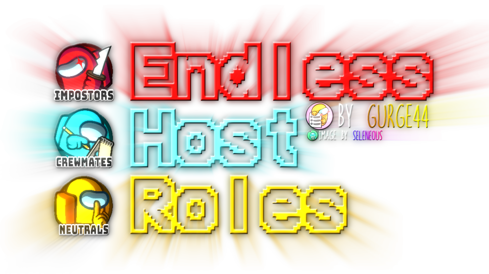

<h1 align="center">Endless Host Roles</h1>
<h4 align="center">The largest Among Us mod.<br>Completely free.<br>Host-Only.<br>Fully customizable.<br>100% transparency.<br>No accounts or logins required.</h4>

<br>



<p align="right">

> ### Regarding this mod
>
> This mod is not affiliated with Among Us or Innersloth LLC, and the content contained therein is not endorsed or
> otherwise sponsored by Innersloth LLC. Portions of the materials contained herein are the property of Innersloth LLC.
> <br>
> This is not a cheat, it's a mod that adds new roles and features to the game. If you have questions, ask in our
> Discord server.
<br>

</p>
<p align="center">

<a href="https://sites.google.com/view/ehr-au" target="_blank"></a>
<a href="https://discord.gg/m3ayxfumC8" target="_blank"></a>
<a href="https://github.com/Gurge44/EndlessHostRoles/releases/latest" target="_blank"></a>

</p>

<p align="left" style="font-size: 10px"><i>Image by oCelestino & Seleneous on Discord</i></p>
---

<br>

# Installation

- Follow the manual guide on our website: [EHR](https://sites.google.com/view/ehr-au)
- Or watch the tutorial by AnonWorks: [YouTube](https://youtu.be/AOLqWCbbrHM?si=nRRsNgz5-Z8XvFrs)

<br>

Share the download link with your friends: [bit.ly/downloadehr](https://bit.ly/downloadehr)

## Want to become a beta tester?

Join our Discord server and download the latest test build from the #test-builds channel.
You do **NOT** need to pay, boost the server, donate, be a VIP, contributor or anything like that.
In this mod and its discord server, everything is free.
We don't want your money, we want your feedback.
You can also report bugs and suggest features in the #bug-reports and #suggestions channels.

#### How to install test builds:

1. Download the latest test build (EHR.dll) from the #test-builds channel.
2. Go to your Among Us directory (usually `C:\Program Files (x86)\Steam\steamapps\common\Among Us` for Steam users,
   `C:\Program Files\AmongUs` for Epic Games users, `C:\Program Files\WindowsApps\InnerSloth.LLC-AmongUs_8wekyb3d8bbwe`
   for Microsoft Store users).
3. Go into the `BepInEx` folder.
4. Go into the `plugins` folder.
5. Replace the existing `EHR.dll` file with the one you downloaded.

### Visit this website to find role descriptions: [Role description finder](https://gurge44.pythonanywhere.com/)

#### Over 400 roles and add-ons, 10 custom game modes, and a custom team assigner application, making EHR the most extensive mod for Among Us. And it's all free, and only the host needs to have the mod installed for the entire lobby to play!

## List of Roles <span style="font-size: 12px;">(excluding Hide and Seek roles and vanilla roles)</span>

| Crewmates         | Impostors       | Neutrals          | Add-ons        |
|-------------------|-----------------|-------------------|----------------|
| Addict            | Abyssbringer    | Agitator          | Allergic       |
| Adrenaline        | Anonymous       | Amnesiac          | Antidote       |
| Adventurer        | Anti-Adminer    | Amogus            | Anti-TP        |
| Aid               | Arrogance       | Arsonist          | Asthmatic      |
| Alchemist         | Assumer         | Backstabber       | Autopsy        |
| Altruist          | Augmenter       | Bandit            | Avenger        |
| Analyst           | Bard            | Bargainer         | Bait           |
| Ankylosaurus      | Blackmailer     | Beehive           | Busy           |
| Autocrat          | Bomber          | Blood Knight      | Beartrap       |
| Bane              | Bounty Hunter   | Bubble            | Bewilder       |
| Beacon            | Butcher         | Chemist           | Bloodlust      |
| Benefactor        | Camouflager     | Cherokious        | Bloodmoon      |
| Bodyguard         | Capitalist      | Collector         | Charmed        |
| Camera Man        | Cantankerous    | Curser            | Circumvent     |
| Car               | Changeling      | Deathknight       | Cleansed       |
| Catcher           | Chronomancer    | Demon             | Clumsy         |
| Celebrity         | Cleaner         | Doppelganger      | Contagious     |
| Chameleon         | Commander       | Doomsayer         | Damocles       |
| Chef              | Consigliere     | Eclipse           | Deadlined      |
| Clairvoyant       | Consort         | Enderman          | Deadly Quota   |
| Cleanser          | Councillor      | Evolver           | Disco          |
| Convener          | Crewpostor      | Executioner       | Diseased       |
| Copycat           | Cursed Wolf     | Follower          | Dynamo         |
| Coroner           | Deathpact       | Gaslighter        | Disregarded    |
| Crusader          | Devourer        | The Glitch        | Double Shot    |
| Dad               | Disperser       | God               | Egoist         |
| Demolitionist     | Duellist        | Hater             | Energetic      |
| Deputy            | Dazzler         | Head Hunter       | Evil Spirit    |
| Detective         | Echo            | Hex Master        | Finder         |
| Detour            | Escapist        | Hookshot          | Flash          |
| Dictator          | Evil Eraser     | Imitator          | Fragile        |
| Doctor            | Evil Guesser    | Impartial         | Fool           |
| Donut Delivery    | Evil Tracker    | Innocent          | Giant          |
| Door Master       | Fireworker      | Jackal            | Glow           |
| Pacifist          | Framer          | Jester            | Gravestone     |
| Drainer           | Freezer         | Jinx              | Guardian Angel |
| Druid             | Gambler         | Juggernaut        | Guesser        |
| Electric          | Gangster        | Lawyer            | Haste          |
| Enigma            | Generator       | Magician          | Haunter        |
| Escort            | Godfather       | Vector            | Introvert      |
| Express           | Greedy          | Maverick          | Knighted       |
| Investigator      | Hangman         | Medusa            | Last Impostor  |
| Fortune Teller    | Hitman          | Mycologist        | Lazy           |
| Gaulois           | Hypnotist       | Necro-Guesser     | Lovers         |
| Goose             | Inhibitor       | Necromancer       | Loyal          |
| Grappler          | Kamikaze        | Nonplus           | Lucky          |
| Grenadier         | Kidnapper       | Note Killer       | Madmate        |
| Guess Manager     | Killing Machine | Opportunist       | Magnet         |
| Guardian          | Lightning       | Patroller         | Mare           |
| Ignitor           | Librarian       | Pelican           | Messenger      |
| Insight           | Lurker          | Pestilence        | Mimic          |
| Inspector         | Mafioso         | Specter           | Minion         |
| Inquirer          | Mastermind      | Pickpocket        | Mischievous    |
| Jailor            | Nemesis         | Plaguebearer      | Necroview      |
| Journalist        | Mercenary       | Infection         | Nimble         |
| Judge             | Miner           | Poisoner          | Noisy          |
| Lazy Guy          | Morphling       | Postman           | Oblivious      |
| Leery             | Ninja           | Predator          | Onbound        |
| Lighter           | Nuker           | Provocateur       | Spurt          |
| Lookout           | Nullifier       | Pursuer           | Sleep          |
| Luckey            | Occultist       | Pyromaniac        | Phantasm       |
| Lyncher           | Overheat        | Quiz Master       | Physicist      |
| Markseeker        | Parasite        | Reckless          | Rascal         |
| Marshall          | Penguin         | Revolutionist     | Reach          |
| Mathematician     | Puppeteer       | Ritualist         | Recruit        |
| Mayor             | Quick Shooter   | Rogue             | Rookie         |
| Mechanic          | Renegade        | Romantic          | Trainee        |
| Medic             | Rift Maker      | Roulette Grandeur | Schizophrenic  |
| Medium            | Saboteur        | Ruthless Romantic | Seer           |
| Merchant          | Sapper          | Samurai           | Sleuth         |
| Telecommunication | Scavenger       | Schrödinger's Cat | Sonar          |
| Mole              | Silencer        | Serial Killer     | Stained        |
| Monarch           | Sniper          | Shifter           | Taskcounter    |
| Mortician         | Soul Catcher    | Sidekick          | Stealer        |
| Nice Eraser       | Stasis          | Simon             | Stressed       |
| Nice Guesser      | Swapster        | Soul Hunter       | Swift          |
| Hacker            | Swiftclaw       | Spiritcaller      | Sunglasses     |
| Swapper           | Swooper         | Sprayer           | Tiebreaker     |
| Nightmare         | Stealth         | Stalker           | Torch          |
| Negotiator        | Time Thief      | Cultist           | Truant         |
| Observer          | Trapster        | Sunnyboy          | Undead         |
| Oracle            | Trickster       | Technician        | Unlucky        |
| Oxyman            | Twister         | Tank              | Warden         |
| Paranoid          | Underdog        | Terrorist         | Watcher        |
| Perceiver         | Undertaker      | Tiger             | Workhorse      |
| President         | Vampire         | Traitor           | YouTuber       |
| Psychic           | Ventriloquist   | Tremor            |                |
| Rabbit            | Vindicator      | Vengeance         |                |
| Randomizer        | Visionary       | Vengeful Romantic |                |
| Rhapsode          | Warlock         | Virus             |                |
| Ricochet          | Wasp            | Vortex            |                |
| Safeguard         | Wildling        | Vulture           |                |
| Scout             | Witch           | Wraith            |                |
| Security Guard    | Yin Yanger      | Werewolf          |                |
| Sentinel          | Zombie          | Weapon Master     |                |
| Sentry            | Double Agent    | Weatherman        |                |
| Sheriff           |                 | Workaholic        |                |
| Shiftguard        |                 |                   |                |
| Snitch            |                 |                   |                |
| Socialite         |                 |                   |                |
| Soothsayer        |                 |                   |                |
| Spiritualist      |                 |                   |                |
| Speedrunner       |                 |                   |                |
| Speed Booster     |                 |                   |                |
| Spy               |                 |                   |                |
| Super Star        |                 |                   |                |
| Task Manager      |                 |                   |                |
| Telekinetic       |                 |                   |                |
| Tether            |                 |                   |                |
| Time Manager      |                 |                   |                |
| Time Master       |                 |                   |                |
| Toilet Master     |                 |                   |                |
| Tornado           |                 |                   |                |
| Transmitter       |                 |                   |                |
| Transporter       |                 |                   |                |
| Tracefinder       |                 |                   |                |
| Tunneler          |                 |                   |                |
| Ventguard         |                 |                   |                |
| Veteran           |                 |                   |                |
| Vigilante         |                 |                   |                |
| Whisperer         |                 |                   |                |
| Witness           |                 |                   |                |
| Wizard            |                 |                   |                |

## VIP and Moderator perks

:heavy_check_mark:   Can always use the command<br>
:x:   Can never use the command<br>
:question:    Host setting determines<br>

| Feature   | Regular Players | VIP                | Moderator          | Host               |
|-----------|-----------------|--------------------|--------------------|--------------------|
| /color    | :question:      | :heavy_check_mark: | :question:         | :heavy_check_mark: |
| /rename   | :question:      | :heavy_check_mark: | :question:         | :heavy_check_mark: |
| /kick     | :x:             | :x:                | :heavy_check_mark: | :heavy_check_mark: |
| /ban      | :x:             | :x:                | :heavy_check_mark: | :heavy_check_mark: |
| /say      | :x:             | :x:                | :heavy_check_mark: | :heavy_check_mark: |
| /poll     | :x:             | :x:                | :heavy_check_mark: | :heavy_check_mark: |
| /mute     | :x:             | :x:                | :heavy_check_mark: | :heavy_check_mark: |
| Lobby tag | :x:             | :heavy_check_mark: | :heavy_check_mark: | :heavy_check_mark: |

<br>

## Want to translate the mod to your language?

Click this badge to view our translation project on Crowdin:
[](https://crowdin.com/project/ehr)
<br>
Source language: English

#### Translation progress

[].data.translationProgress&url=https%3A%2F%2Fbadges.awesome-crowdin.com%2Fstats-15788979-676754.json)](https://crowdin.com/project/ehr)
[].data.translationProgress&url=https%3A%2F%2Fbadges.awesome-crowdin.com%2Fstats-15788979-676754.json)](https://crowdin.com/project/ehr)
[].data.translationProgress&url=https%3A%2F%2Fbadges.awesome-crowdin.com%2Fstats-15788979-676754.json)](https://crowdin.com/project/ehr)
[].data.translationProgress&url=https%3A%2F%2Fbadges.awesome-crowdin.com%2Fstats-15788979-676754.json)](https://crowdin.com/project/ehr)
[].data.translationProgress&url=https%3A%2F%2Fbadges.awesome-crowdin.com%2Fstats-15788979-676754.json)](https://crowdin.com/project/ehr)
[].data.translationProgress&url=https%3A%2F%2Fbadges.awesome-crowdin.com%2Fstats-15788979-676754.json)](https://crowdin.com/project/ehr)
[].data.translationProgress&url=https%3A%2F%2Fbadges.awesome-crowdin.com%2Fstats-15788979-676754.json)](https://crowdin.com/project/ehr)

[](https://crowdin.com/project/ehr)

<br>

## Should I switch from TOHE to EHR?

- In comparison, both mods are great, but EHR has more roles, features, game modes, and settings.
- Moreover, EHR contains almost all the roles from TOHE, so you won't be missing out on anything.
- Some roles were deleted or reworked to make them more balanced or to make them fit better with the new roles.
- If you switch to EHR, you will have access to all features without paying for anything.
- Test builds are available for free in our Discord server, and you can report bugs and suggest features there as well.
- /up was reworked to /setrole, allowing you to set anyone's role for the next game, not only yours.
- You can fully gain access to /setrole by just hosting EHR lobbies weekly or uploading EHR content to YouTube, but
  everyone can use /setrole to set their own role without any requirements (essentially /up).
- EHR has a custom team assigner application, which is a unique feature that no other mod has.
- You can force or ban certain role/add-on combinations directly in the game using /combo.
- Not sure how to use commands? Use /help to see a list of all available commands.
- EHR helps the host use commands by directly displaying their short descriptions, arguments, descriptions for all
  arguments, and checking whether an argument is valid or not.
- You can also press TAB to autocomplete commands.
- Some hints and tips are displayed during the loading screen and ejection animations, which can help you discover new
  features.
- EHR has 10 unique custom game modes, which can be played with any number of players, some even alone.
- You can make lobbies with more than 15 players on modded servers, just type /cs players 100 - for example - to set the
  player limit to 100.
- I, the main developer of EHR, care about user feedback and suggestions, and I try to implement them as much as
  possible.
- If this wasn't convincing enough, you can always try EHR and see if you like it better than TOHE.
- In the end, it's your choice, and I respect it.

#### There are more game changing features, which you can find on our website: [EHR](https://sites.google.com/view/ehr-au)

<br>


<br>

## Credit to these mods and their developers for the code and help:

### :star: [TOHER/TOHRE/TOHEN](https://github.com/0xDrMoe/TownofHost-Enhanced) :

>
> - Our repo is forked from TOHRE (from a long time ago)
> - Thanks: Better Anti-Blackout
> - Thanks: Phantom-basis fix for desynced roles
>

### :star: [TOHE/TONX](https://github.com/KARPED1EM/TownOfHostEdited) :

>
> - Our repo is a continuation of TOHE
> - TONX reference: Modify character limit for chat messages
> - TONX reference: Modify and apply cool animations on Main Menu
>

### :star: [TOH](https://github.com/tukasa0001/TownOfHost) :

>
> - Our repo is based initially on TOH
>

### :star: [TOHY](https://github.com/Yumenopai/TownOfHost_Y) :

>
> - Many role ideas
> - Provided roles: AntiAdminer, CursedWolf, Workaholic, Greedier, DarkHide, Ignitor, Rabbit
> - Reference: Modify game announcement
> - New settings UI for v2024.6.18
> - Reference: Role Basis Changing Mid-Game
>

### :star: [TOH:TOR](https://github.com/music-discussion/TownOfHost-TheOtherRoles) :

>
> - Many role ideas
> - Reference: Exile Confirm
> - Reference: Split RPC Pack
>

### :star: [SNR](https://github.com/ykundesu/SuperNewRoles) :

>
> - Reference: Credentials menu
> - Reference: Switch Horse Mode
> - Reference: Search Mod Game
> - Reference: Custom Button
>

### :star: [TOP](https://github.com/tugaru1975/TownOfPlus) :

>
> - Reference: Zoom
>

### :star: [RHR](https://github.com/sansaaaaai/Revolutionary-host-roles) :

>
> - Reference: Modify settings menu
>

### :star: [TOH+](https://github.com/SkullCreeper/TownOfHostPlus) :

>
> - Provided roles: Marshall, Poisoner, Necroview, Sidekick
>

### :star: [PL](https://github.com/Lotus-AU/LotusContinued) :

>
> - Ideas for some roles
> - Reference: Customize Main Menu
> - Reference: Auto Play Again
> - Reference: Some TabIcons
>

### :star: [Stellar Roles](https://github.com/Mr-Fluuff/StellarRolesAU) :

>
> - Many role ideas (this mod is seriously amazing)
> - Reference: Some custom button images
>

### :star: [TOHEX/TONEX](https://github.com/TOHEX-Official/TownOfHostEdited-Xi) :

>
> - Provided the role: Swapper
> - Reference: Store message history
>

### :star: [More Gamemodes](https://github.com/Rabek009/MoreGamemodes) :

>
> - Reference: Part of the code used for the Endless Host Roles Image in the Main Menu
> - Reference: Custom Net Objects
> - Reference: Block vent interaction for players who cannot use vents
>

### :star: [Reactor](https://github.com/NuclearPowered/Reactor) :

>
> - Reference: Disable the 5s timeout on custom servers
>

### :star: [TOHO](https://github.com/Limeau/TownofHost-Optimized) :

>
> - Reference: Some role ideas (Tank, Deadlined, Journalist, Grappler, Negotiator, Hypnotist, etc.)
>

### :star: [Mini.RegionInstall](https://github.com/miniduikboot/Mini.RegionInstall) :

>
> - Reference: Custom Region Installer (adding modded regions)
>

### :star: [Crowded](https://github.com/CrowdedMods/CrowdedMod)

>
> - Crowded is integrated into EHR

### Endless Host Roles (EHR), with Endless Possibilities, brought to you by the Endless Network.

##### Developers:

- Gurge44

##### Contributors:

- Dx
- PH_Gaming
- TommyXL
- Drakos
- Peppercula

##### Special Thanks:

- Seleneous
- thewhiskas27
- HyperAtill
- Sil

##### Translators:

- Dx (PT-BR)
- PH_Gaming (PT-BR)
- Tomix (PT-BR)
- HyperAtill (RU)
- ABoringCat (ZH-CN)
- Reborn (ZH-CN)

# License for the Custom Team Assigner application (everything inside the `CTA` folder)

```
Copyright (c) 2024, Gurge44

All rights reserved.

Redistribution and use in source and binary forms, with or without
modification, are permitted provided that the following conditions are met:

1. Redistributions of source code must retain the above copyright
   notice, this list of conditions and the following disclaimer.
2. Redistributions in binary form must reproduce the above copyright
   notice, this list of conditions and the following disclaimer in the
   documentation and/or other materials provided with the distribution.
3. All advertising materials mentioning features or use of this software
   must display the following acknowledgement:
   This product includes software developed by Gurge44.
4. Neither the name of the Endless Network nor the
   names of its contributors may be used to endorse or promote products
   derived from this software without specific prior written permission.

THIS SOFTWARE IS PROVIDED BY THE COPYRIGHT HOLDER ''AS IS'' AND ANY
EXPRESS OR IMPLIED WARRANTIES, INCLUDING, BUT NOT LIMITED TO, THE IMPLIED
WARRANTIES OF MERCHANTABILITY AND FITNESS FOR A PARTICULAR PURPOSE ARE
DISCLAIMED. IN NO EVENT SHALL THE COPYRIGHT HOLDER OR CONTRIBUTORS BE LIABLE
FOR ANY DIRECT, INDIRECT, INCIDENTAL, SPECIAL, EXEMPLARY, OR CONSEQUENTIAL
DAMAGES (INCLUDING, BUT NOT LIMITED TO, PROCUREMENT OF SUBSTITUTE GOODS OR
SERVICES; LOSS OF USE, DATA, OR PROFITS; OR BUSINESS INTERRUPTION) HOWEVER
CAUSED AND ON ANY THEORY OF LIABILITY, WHETHER IN CONTRACT, STRICT LIABILITY,
OR TORT (INCLUDING NEGLIGENCE OR OTHERWISE) ARISING IN ANY WAY OUT OF THE
USE OF THIS SOFTWARE, EVEN IF ADVISED OF THE POSSIBILITY OF SUCH DAMAGE.
```

# Privacy Policy


### Privacy Policy for EHR Discord Integration

**Effective Date:** 2024-11-09

------------------------------------------------------------------------------------------------------------

#### 1. **Introduction**
This Privacy Policy explains how we collect, use, and handle information related to the EHR Discord integration for your Among Us mod. We are committed to ensuring that your data privacy and security are respected.

------------------------------------------------------------------------------------------------------------

#### 2. **Information Collected**
When using this integration, we collect the following non-personal information:

- **Lobby Code:** A six-letter code that uniquely identifies a game lobby.
- **Server Name:** The region where the game server is hosted (e.g., Asia, EU, NA).
- **User Language:** The selected language for the game (e.g., English, Russian, Spanish).
- **Mod Version:** The version of the Endless Host Roles (EHR) mod being used.
- **Lobby Status:** The current status of the lobby (e.g., In Lobby, In Game, Ended).

------------------------------------------------------------------------------------------------------------

#### 3. **How Information is Used**
The collected information is used solely for the following purposes:

- To notify players about available lobbies via the designated Discord server.
- To update the status of the lobby in real time, enhancing coordination among players.

**No personal data** or any other information beyond what is listed above is collected or processed.

------------------------------------------------------------------------------------------------------------

#### 4. **Data Sharing**
- The collected information is only sent to the EHR Discord server through a webhook.
- No data is shared with third parties or used for any other purposes.

------------------------------------------------------------------------------------------------------------

#### 5. **User Control and Opt-Out**
You have full control over whether to enable or disable data sharing. You can disable this feature by:

1. Opening the **Room Settings** UI.
2. Navigating to the **System Settings** tab.
3. Turning off the setting labeled **Post the lobby code to the EHR Discord server.**

When disabled, no lobby information will be collected or transmitted.

------------------------------------------------------------------------------------------------------------

#### 6. **Data Retention**
- Lobby data is retained only as long as the lobby is active. Once a lobby is closed, the data is removed from our system and the message is deleted from the Discord server after 30 minutes.
- We do not store historical records of lobbies after they are removed.

------------------------------------------------------------------------------------------------------------

#### 7. **Changes to this Privacy Policy**
We may update this Privacy Policy from time to time. Any changes will be communicated through an update in the mod or via the official EHR Discord channel.

------------------------------------------------------------------------------------------------------------

#### 8. **Contact Us**
If you have any questions about this Privacy Policy or how your data is handled, please contact us at:

**[The EHR Discord Server](https://discord.gg/m3ayxfumC8)**

------------------------------------------------------------------------------------------------------------

By using the EHR Discord integration, you agree to the terms outlined in this Privacy Policy.