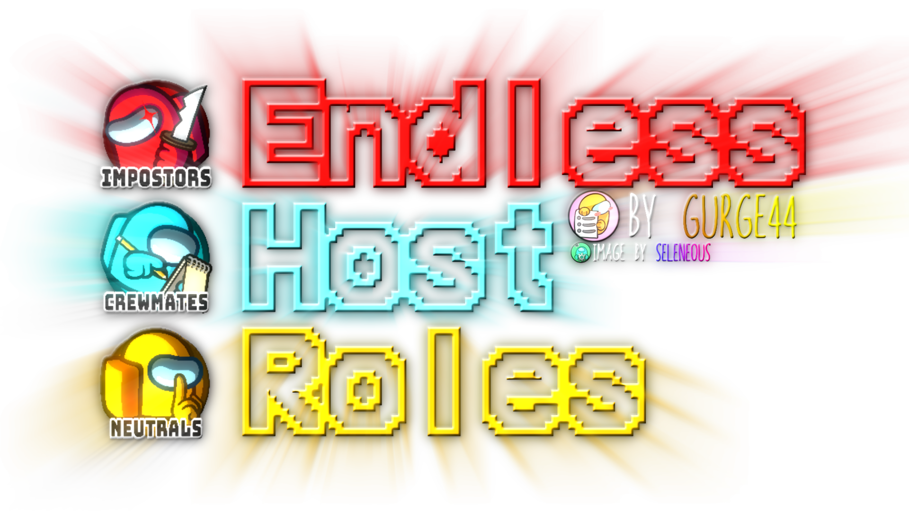

<div align="center">

# Endless Host Roles

### The largest Among Us mod
**Completely free • Host-Only • Fully customizable • 100% transparency • No accounts or logins required**

[](https://discord.gg/m3ayxfumC8)
[](https://ehr-wiki.gurge44.eu)
[](https://github.com/Gurge44/EndlessHostRoles/releases/latest)
[](https://translate.gurge44.eu)

[](https://github.com/Gurge44/EndlessHostRoles/releases/latest)
[](https://github.com/Gurge44/EndlessHostRoles/releases)
[](https://github.com/Gurge44/EndlessHostRoles/commits)
[](https://github.com/Gurge44/EndlessHostRoles)


<p align="center">
  
</p>
<p align="left" style="font-size: 10px"><i>Image by thecelestrinity & Seleneous on Discord</i></p>
</div>

---

### Regarding this mod

<div align="left">
  
> This mod is not affiliated with Among Us or Innersloth LLC, and the content contained therein is not endorsed or otherwise sponsored by Innersloth LLC.  
> Portions of the materials contained herein are the property of Innersloth LLC.  
>  
> This is **not a cheat**, it's a mod that adds new roles and features to the game.  
> If you have questions, ask in our Discord server.

</div>

# Installation

- Follow the manual guide on our website: [EHR Wiki](https://ehr-wiki.gurge44.eu/en/guides/installation/)
- Or watch the tutorial by AnonWorks: [YouTube](https://youtu.be/AOLqWCbbrHM?si=nRRsNgz5-Z8XvFrs)

<br>

Share the download link with your friends: [bit.ly/downloadehr](https://bit.ly/downloadehr)

<br>

## Want to become a beta tester?

Join our Discord server and download the latest test build from the #test-builds channel.
You do **NOT** need to pay, boost the server, donate, be a VIP, Contributor or anything like that.
In this mod and its discord server, everything is free.
We don't want your money, we want your feedback.
You can also report bugs and suggest features in the #bug-reports and #suggestions channels.

#### How to install test builds:

1. Download the latest test build (EHR.dll) from the #test-builds channel.
2. Go to your Among Us directory (usually `C:\Program Files (x86)\Steam\steamapps\common\Among Us` for Steam users,
   `C:\Program Files\AmongUs` for Epic Games users, `C:\Program Files\WindowsApps\InnerSloth.LLC-AmongUs_8wekyb3d8bbwe`
   for Microsoft Store users).
3. Go into the `BepInEx` folder.
4. Go into the `plugins` folder.
5. Replace the existing `EHR.dll` file with the one you downloaded.

### Visit this website to find role descriptions: [Role description finder](https://ehr.gurge44.eu/lookup)

### You can make yourself a global EHR tag and see active EHR lobbies here: [Active EHR Lobbies](https://app.gurge44.eu/lobbies)

#### Over 450+ roles and add-ons, 16 custom game modes, and a Custom Team Assigner application, making EHR the most extensive mod for Among Us. And it's all free, and only the host needs to have the mod installed for the entire lobby to play!

## List of Roles <span style="font-size: 12px;">(excluding (Custom) Hide And Seek roles and Vanilla roles)</span>

| Crewmates         | Impostors       | Neutrals          | Coven         | Add-ons        |
|-------------------|-----------------|-------------------|---------------|----------------|
| Addict            | Abyssbringer    | Accumulator       | Augur         | Absorber       |
| Adrenaline        | Ambusher        | Agitator          | Banshee       | Aide           |
| Adventurer        | Anonymous       | Amnesiac          | Coven Leader  | Allergic       |
| Aid               | Anti-Adminer    | Amogus            | Coven Member  | Anchor         |
| Alchemist         | Arrogance       | Arsonist          | Death         | Antidote       |
| Altruist          | Assumer         | Auditor           | Dreamweaver   | Anti-TP        |
| Analyst           | Augmenter       | Backstabber       | Empress       | Asthmatic      |
| Ankylosaurus      | Bard            | Bandit            | Enchanter     | Autopsy        |
| Astral            | Blackmailer     | Bargainer         | Goddess       | Avenger        |
| Autocrat          | Bomber          | Beehive           | Illusionist   | Bait           |
| Bane              | Bounty Hunter   | Berserker         | Moon Dancer   | Banana Man     |
| Battery           | Butcher         | Blockade          | Poache        | Beartrap       |
| Beacon            | Camouflager     | Blood Knight      | Potion Master | Bewilder       |
| Benefactor        | Capitalist      | Bubble            | Reaper        | Blessed        |
| Bestower          | Cantankerous    | Chemist           | Shadow        | Blind          |
| Bodyguard         | Catalyst        | Cherokious        | Siren         | Blocked        |
| Camera Man        | Centralizer     | Clerk             | Spellcaster   | Bloodlust      |
| Captain           | Chainbinder     | Collector         | Summoner      | Bloodmoon      |
| Car               | Changeling      | Curser            | Timelord      | Busy           |
| Carrier           | Chronomancer    | Dealer            | Voodoo Master | Charmed        |
| Catcher           | Cleaner         | Deathknight       | Wyrd          | Circumvent     |
| Chameleon         | Clock Blocker   | Demon             |               | Cleansed       |
| Chef              | Commander       | Doppelganger      |               | Clumsy         |
| Clairvoyant       | Consigliere     | Doomsayer         |               | Committed      |
| Cleanser          | Consort         | Duality           |               | Compelled      |
| Convener          | Councillor      | Eclipse           |               | Composter      |
| Copycat           | Crewpostor      | Enderman          |               | Concealer      |
| Coroner           | Cursed Wolf     | Evolver           |               | Constricted    |
| Crusader          | Deathpact       | Executioner       |               | Contagious     |
| Dad               | Devourer        | Explosivist       |               | Damocles       |
| Decryptor         | Disperser       | Follower          |               | Deadlined      |
| Demolitionist     | Duellist        | Gaslighter        |               | Deadly Quota   |
| Deputy            | Dazzler         | The Glitch        |               | Disco          |
| Detour            | Echo            | God               |               | Diseased       |
| Dictator          | Escapist        | Hater             |               | Disregarded    |
| Doctor            | Evil Eraser     | Head Hunter       |               | Dizzy          |
| Donut Delivery    | Evil Guesser    | Hex Master        |               | Dynamo         |
| Doorjammer        | Evil Tracker    | Hookshot          |               | Double Shot    |
| Double Agent      | Exclusionary    | Impartial         |               | Egoist         |
| Drainer           | Exorcist        | Infection         |               | Energetic      |
| Druid             | Fabricator      | Innocent          |               | Entombed       |
| Electric          | Fakeshifter     | Investor          |               | Entranced      |
| Enigma            | Fireworker      | Jackal            |               | Evil Spirit    |
| Escort            | Forger          | Jackpot           |               | Examiner       |
| Express           | Framer          | Jester            |               | Facilitator    |
| Farmer            | Freezer         | Jinx              |               | Finder         |
| Forensic          | Frightener      | Juggernaut        |               | Flash          |
| Fortune Teller    | Gambler         | Lawyer            |               | Fragile        |
| Gardener          | Gangster        | Magician          |               | Fool           |
| Gaulois           | Generator       | Magistrate        |               | Giant          |
| Goose             | Godfather       | Maverick          |               | Glow           |
| Grappler          | Greedy          | Medusa            |               | Gravestone     |
| Grenadier         | Hangman         | Mycologist        |               | Guardian Angel |
| Meeting Manager   | Hitman          | Necro-Guesser     |               | Guesser        |
| Guardian          | Hypnotist       | Necromancer       |               | Haste          |
| Hacker            | Hypocrite       | Nonplus           |               | Haunter        |
| Helper            | Inhibitor       | Note Killer       |               | Hidden         |
| Ignitor           | Kamikaze        | Opportunist       |               | Insane         |
| Imitator          | Kidnapper       | Patroller         |               | Introvert      |
| Insight           | Killing Machine | Pawn              |               | Knighted       |
| Inspector         | Lightning       | Pelican           |               | Last Impostor  |
| Investigator      | Librarian       | Pestilence        |               | Lazy           |
| Inquirer          | Loner           | Specter           |               | Listener       |
| Inquisitor        | Lurker          | Pickpocket        |               | Looter         |
| Jailor            | Mafioso         | Plaguebearer      |               | Lovers         |
| Journalist        | Mastermind      | Poisoner          |               | Loyal          |
| Judge             | Nemesis         | Postman           |               | Lucky          |
| Lazy Guy          | Mercenary       | Predator          |               | Madmate        |
| Leery             | Miner           | Provocateur       |               | Magnet         |
| Lighter           | Morphling       | Pulse             |               | Mare           |
| Lookout           | Ninja           | Pursuer           |               | Meeting Angel  |
| Luckey            | Nuker           | Pyromaniac        |               | Messenger      |
| Markseeker        | Nullifier       | Quarry            |               | Mimic          |
| Marshall          | Obstructer      | Quiz Master       |               | Minion         |
| Mathematician     | Occultist       | Reckless          |               | Mischievous    |
| Mayor             | Overheat        | Revolutionist     |               | Necroview      |
| Mechanic          | Parasite        | Ritualist         |               | Nimble         |
| Medic             | Penguin         | Rogue             |               | Noisy          |
| Medium            | Perplexer       | Romantic          |               | Oblivious      |
| Merchant          | Postponer       | Room Rusher       |               | Onbound        |
| Mole              | Psychopath      | Roulette Grandeur |               | Spurt          |
| Monarch           | Puppeteer       | Ruthless Romantic |               | Sleep          |
| Mortician         | Quick Shooter   | Samurai           |               | Phantasm       |
| Nice Eraser       | Renegade        | Schrödinger's Cat |               | Physicist      |
| Nice Guesser      | Rift Maker      | Seamstress        |               | Rascal         |
| Nightmare         | Saboteur        | Serial Killer     |               | Reach          |
| Negotiator        | Sapper          | Sharpshooter      |               | Rookie         |
| Observer          | Scavenger       | Shifter           |               | Reroll         |
| Operative         | Silencer        | Sidekick          |               | Trainee        |
| Oracle            | Sniper          | Simon             |               | Schizophrenic  |
| Oxyman            | Soul Catcher    | Slenderman        |               | Seer           |
| Pacifist          | Stasis          | Soul Collector    |               | Shade          |
| Paranoid          | Swapster        | Soul Hunter       |               | Shy            |
| Perceiver         | Swiftclaw       | Spider            |               | Sleuth         |
| Portal Maker      | Swooper         | Spirit            |               | Sonar          |
| President         | Stealth         | Spiritcaller      |               | Stained        |
| Psychic           | Time Thief      | Sprayer           |               | Stealer        |
| Rabbit            | Trapster        | Stalker           |               | Stressed       |
| Randomizer        | Trickster       | Starspawn         |               | Swift          |
| Retributionist    | Twister         | Cultist           |               | Sunglasses     |
| Revenant          | Undertaker      | Sunnyboy          |               | Talkative      |
| Rhapsode          | Vampire         | Tank              |               | Taskcounter    |
| Ricochet          | Venerer         | Technician        |               | Task Master    |
| Safeguard         | Ventriloquist   | Terrorist         |               | Tiebreaker     |
| Scanner           | Vindicator      | Thanos            |               | Tired          |
| Scout             | Visionary       | Thief             |               | Torch          |
| Security Guard    | Warlock         | Tiger             |               | Truant         |
| Sensor            | Wasp            | Traitor           |               | Unbound        |
| Sentinel          | Wildling        | Tremor            |               | Undead         |
| Sentry            | Wiper           | Vector            |               | Underdog       |
| Sheriff           | Witch           | Vengeance         |               | Unlucky        |
| Shiftguard        | Yin Yanger      | Vengeful Romantic |               | Urgent         |
| Snitch            | Zombie          | Virus             |               | Venom          |
| Socialite         |                 | Vortex            |               | Warden         |
| Soothsayer        |                 | Vulture           |               | Watcher        |
| Spiritualist      |                 | Wraith            |               | Workhorse      |
| Speedrunner       |                 | Werewolf          |               | YouTuber       |
| Speed Booster     |                 | Weapon Master     |               |                |
| Spy               |                 | Weatherman        |               |                |
| Super Star        |                 | Workaholic        |               |                |
| Survivor          |                 |                   |               |                |
| Swapper           |                 |                   |               |                |
| Tar               |                 |                   |               |                |
| Task Manager      |                 |                   |               |                |
| Telecommunication |                 |                   |               |                |
| Telekinetic       |                 |                   |               |                |
| Tether            |                 |                   |               |                |
| Time Manager      |                 |                   |               |                |
| Time Master       |                 |                   |               |                |
| Toilet Master     |                 |                   |               |                |
| Tornado           |                 |                   |               |                |
| Transmitter       |                 |                   |               |                |
| Transporter       |                 |                   |               |                |
| Tracefinder       |                 |                   |               |                |
| Tree              |                 |                   |               |                |
| Tunneler          |                 |                   |               |                |
| Unshifter         |                 |                   |               |                |
| Vacuum            |                 |                   |               |                |
| Ventguard         |                 |                   |               |                |
| Veteran           |                 |                   |               |                |
| Vigilante         |                 |                   |               |                |
| Whisperer         |                 |                   |               |                |
| Witness           |                 |                   |               |                |
| Wizard            |                 |                   |               |                |
|                   |                 |                   |               |                |
| 144               | 113             | 120               | 21            | 117            |

## VIP, Moderator, and Admin perks

:heavy_check_mark:   Can always use the command<br>
:x:   Can never use the command<br>
:question:    Host setting determines<br>

| Feature     | Regular Players | VIP                | Moderator          | Admin              | Host               |
|-------------|-----------------|--------------------|--------------------|--------------------|--------------------|
| /color      | :question:      | :heavy_check_mark: | :heavy_check_mark: | :heavy_check_mark: | :heavy_check_mark: |
| /rename     | :question:      | :heavy_check_mark: | :heavy_check_mark: | :heavy_check_mark: | :heavy_check_mark: |
| /tpin       | :question:      | :heavy_check_mark: | :heavy_check_mark: | :heavy_check_mark: | :heavy_check_mark: |
| /tpout      | :question:      | :heavy_check_mark: | :heavy_check_mark: | :heavy_check_mark: | :heavy_check_mark: |
| /kick       | :x:             | :x:                | :heavy_check_mark: | :heavy_check_mark: | :heavy_check_mark: |
| /ban        | :x:             | :x:                | :heavy_check_mark: | :heavy_check_mark: | :heavy_check_mark: |
| /say        | :x:             | :x:                | :heavy_check_mark: | :heavy_check_mark: | :heavy_check_mark: |
| /start      | :x:             | :x:                | :heavy_check_mark: | :heavy_check_mark: | :heavy_check_mark: |
| /poll       | :x:             | :x:                | :heavy_check_mark: | :heavy_check_mark: | :heavy_check_mark: |
| /mute       | :x:             | :x:                | :heavy_check_mark: | :heavy_check_mark: | :heavy_check_mark: |
| /ds         | :x:             | :x:                | :heavy_check_mark: | :heavy_check_mark: | :heavy_check_mark: |
| /mpoll      | :x:             | :x:                | :heavy_check_mark: | :heavy_check_mark: | :heavy_check_mark: |
| /gmpoll     | :x:             | :x:                | :heavy_check_mark: | :heavy_check_mark: | :heavy_check_mark: |
| /fix        | :x:             | :x:                | :heavy_check_mark: | :heavy_check_mark: | :heavy_check_mark: |
| /readycheck | :x:             | :x:                | :heavy_check_mark: | :heavy_check_mark: | :heavy_check_mark: |
| /exe        | :x:             | :x:                | :x:                | :heavy_check_mark: | :heavy_check_mark: |
| /end        | :x:             | :x:                | :x:                | :heavy_check_mark: | :heavy_check_mark: |
| /afkexempt  | :x:             | :x:                | :x:                | :heavy_check_mark: | :heavy_check_mark: |
| /os         | :x:             | :x:                | :x:                | :heavy_check_mark: | :heavy_check_mark: |
| /unmute     | :x:             | :x:                | :x:                | :heavy_check_mark: | :heavy_check_mark: |
| /end        | :x:             | :x:                | :x:                | :heavy_check_mark: | :heavy_check_mark: |
| Lobby tag   | :x:             | :heavy_check_mark: | :heavy_check_mark: | :heavy_check_mark: | :heavy_check_mark: |

<br>

## Want to translate the mod to your language?

Click this badge to view our translation project:
<a href="https://translate.gurge44.eu" target="_blank">
  
</a>
<br>

**Source language:** English
<a href="https://translate.gurge44.eu" target="_blank">
  
</a>
<br>

### Translation progress
[](https://crowdin.com/project/ehr)
<br>

## Should I switch from TOHE to EHR?

- In comparison, both mods are great, but EHR has more roles, features, game modes, and settings.
- Moreover, EHR contains almost all the roles from TOHE, so you won't be missing out on anything.
- Some roles were deleted or reworked to make them more balanced or to make them fit better with the new roles.
- If you switch to EHR, you will have access to all features without paying for anything.
- Test builds are available for free in our Discord server, and you can report bugs and suggest features there as well.
- /up was reworked to /setrole, allowing you to set anyone's role for the next game, not only yours.
- You can fully gain access to /setrole by just hosting EHR lobbies weekly or uploading EHR content to YouTube, but
  everyone can use /setrole to set their own role without any requirements (essentially /up).
- EHR has a Custom Team Assigner application, which is a unique feature that no other mod has.
- You can force or ban certain role/add-on combinations directly in the game using /combo.
- Not sure how to use commands? Use /help to see a list of all available commands.
- EHR helps the host use commands by directly displaying their short descriptions, arguments, descriptions for all
  arguments, and checking whether an argument is valid or not.
- You can also press TAB to autocomplete commands.
- Some hints and tips are displayed during the loading screen and ejection animations, which can help you discover new
  features.
- EHR has 16 unique custom game modes, which can be played with any number of players, some even alone.
- You can make lobbies with more than 15 players on modded servers, just type /cs players 100 - for example - to set the
  player limit to 100.
- I, the main developer of EHR, care about user feedback and suggestions, and I try to implement them as much as
  possible.
- If this wasn't convincing enough, you can always try EHR and see if you like it better than TOHE.
- In the end, it's your choice, and I respect it.

#### There are more game changing features, which you can find on our website: [EHR Wiki](https://ehr-wiki.gurge44.eu/)

<br>

## Chat Commands

| Command                                        | Description                                                                                   | Arguments                                                                                                                                                                                                                                                                                                                    | Usage Level                               | Usage Time                              | 'cmd' prefix<br>required |
|------------------------------------------------|-----------------------------------------------------------------------------------------------|------------------------------------------------------------------------------------------------------------------------------------------------------------------------------------------------------------------------------------------------------------------------------------------------------------------------------|-------------------------------------------|-----------------------------------------|--------------------------|
| /lt                                            | View the lobby timer                                                                          | –                                                                                                                                                                                                                                                                                                                            | :purple_circle: Everyone                  | :green_square: In Lobby                 | :x:                      |
| /dump                                          | Dumps the log file to the desktop                                                             | –                                                                                                                                                                                                                                                                                                                            | :green_circle: Modded Clients             | :purple_square: Always                  | :x:                      |
| /v<br>/version                                 | View the current version of EHR                                                               | –                                                                                                                                                                                                                                                                                                                            | :green_circle: Modded Clients             | :purple_square: Always                  | :x:                      |
| /cs<br>/changesetting                          | Change the game settings                                                                      | &#x1F538; **name** – The setting's name to change (leave blank to view all settings)<br>&#x1F538; **?** – (leave blank to view what to put here)<br>&#x1F539; **?** – (leave blank to view what to put here)<br>                                                                                                             | :yellow_circle: Host                      | :green_square: In Lobby                 | :x:                      |
| /win<br>/winner                                | View the winners of the last game                                                             | –                                                                                                                                                                                                                                                                                                                            | :purple_circle: Everyone                  | :green_square: In Lobby                 | :x:                      |
| /l<br>/lastresult                              | View the roles and add-ons of players in the last game                                        | –                                                                                                                                                                                                                                                                                                                            | :purple_circle: Everyone                  | :green_square: In Lobby                 | :x:                      |
| /rn<br>/rename<br>/name                        | Gives you a new name                                                                          | &#x1F538; **name** – Your new name<br>                                                                                                                                                                                                                                                                                       | :purple_circle: Everyone                  | :green_square: In Lobby                 | :x:                      |
| /hn<br>/hidename                               | Hides your name                                                                               | –                                                                                                                                                                                                                                                                                                                            | :yellow_circle: Host                      | :green_square: In Lobby                 | :x:                      |
| /level                                         | Changes your level                                                                            | &#x1F538; **level** – Your new level<br>                                                                                                                                                                                                                                                                                     | :yellow_circle: Host                      | :green_square: In Lobby                 | :x:                      |
| /n<br>/now                                     | View the current settings                                                                     | –                                                                                                                                                                                                                                                                                                                            | :purple_circle: Everyone                  | :purple_square: Always                  | :x:                      |
| /dis<br>/disconnect                            | Get rid of all players in the specified team                                                  | &#x1F538; **team** – The team to get rid of (imp/crew)<br>                                                                                                                                                                                                                                                                   | :yellow_circle: Host                      | :white_large_square: In Game            | :x:                      |
| /r                                             | View the list of roles or the description of a specific role                                  | &#x1F539; **role** – The role to view (leave blank to view all roles)<br>                                                                                                                                                                                                                                                    | :purple_circle: Everyone                  | :purple_square: Always                  | :x:                      |
| /up                                            | [DEPRECATED] Use /setrole or /setaddon instead                                                | &#x1F538; **role** – The role to set<br>                                                                                                                                                                                                                                                                                     | :yellow_circle: Host                      | :green_square: In Lobby                 | :x:                      |
| /setrole<br>/setaddon                          | Set a player's role/add-on for the next game                                                  | &#x1F538; **id** – The player's ID whose role you want to set<br>&#x1F538; **role** – The role to set<br>                                                                                                                                                                                                                    | :yellow_circle: Host                      | :green_square: In Lobby                 | :x:                      |
| /h<br>/help                                    | View the list of commands                                                                     | –                                                                                                                                                                                                                                                                                                                            | :purple_circle: Everyone                  | :purple_square: Always                  | :x:                      |
| /gamestate<br>/gstate<br>/gs<br>/kcount<br>/kc | View the number of remaining impostors and neutral killers                                    | –                                                                                                                                                                                                                                                                                                                            | :purple_circle: Everyone                  | :white_large_square: In Game            | :x:                      |
| /addmod                                        | Makes the specified player a moderator                                                        | &#x1F538; **id** – The player's ID to make a moderator<br>                                                                                                                                                                                                                                                                   | :yellow_circle: Host                      | :purple_square: Always                  | :x:                      |
| /deletemod                                     | Removes the specified player from the list of moderators                                      | &#x1F538; **id** – The player's ID to remove from the list of moderators<br>                                                                                                                                                                                                                                                 | :yellow_circle: Host                      | :purple_square: Always                  | :x:                      |
| /combo                                         | Set roles and add-ons that always or never spawn together                                     | &#x1F538; **mode** – add/ban/remove/allow (leave blank to view all combos)<br>&#x1F538; **role** – The name of the main role in 1 word<br>&#x1F538; **addon** – The name of the add-on in 1 word<br>&#x1F539; **all** – Whether to apply to all presets (all/[blank])<br>                                                    | :purple_circle: Everyone                  | :purple_square: Always                  | :x:                      |
| /eff<br>/effect                                | Apply a Randomizer effect to yourself                                                         | &#x1F538; **effect** – The name of the effect to apply<br>                                                                                                                                                                                                                                                                   | :yellow_circle: Host                      | :white_large_square: In Game            | :x:                      |
| /afkexempt                                     | Exempt a player from being checked by the AFK detector                                        | &#x1F538; **id** – The player's ID to exempt from AFK detection<br>                                                                                                                                                                                                                                                          | :white_circle: Host And Admins            | :purple_square: Always                  | :x:                      |
| /m<br>/myrole                                  | View the description and settings of your role                                                | –                                                                                                                                                                                                                                                                                                                            | :purple_circle: Everyone                  | :white_large_square: In Game            | :x:                      |
| /tpout                                         | Teleport out of the lobby                                                                     | –                                                                                                                                                                                                                                                                                                                            | :purple_circle: Everyone                  | :green_square: In Lobby                 | :x:                      |
| /tpin                                          | Teleport into the lobby                                                                       | –                                                                                                                                                                                                                                                                                                                            | :purple_circle: Everyone                  | :green_square: In Lobby                 | :x:                      |
| /t<br>/template                                | Send a message template (from template.txt)                                                   | &#x1F538; **tag** – The tag of the template to send<br>                                                                                                                                                                                                                                                                      | :purple_circle: Everyone                  | :purple_square: Always                  | :x:                      |
| /mw<br>/messagewait                            | Set the buffer time for system messages                                                       | &#x1F538; **duration** – The duration in seconds<br>                                                                                                                                                                                                                                                                         | :yellow_circle: Host                      | :purple_square: Always                  | :x:                      |
| /death<br>/d                                   | View who killed you (or another player) and their role                                        | &#x1F539; **id** – The player's ID to view the killer of (leave blank for yourself)<br>                                                                                                                                                                                                                                      | :purple_circle: Everyone                  | :red_square: After Death                | :x:                      |
| /say<br>/s                                     | Send a message as the host/moderator                                                          | &#x1F538; **message** – The message to send<br>                                                                                                                                                                                                                                                                              | :red_circle: Host, Moderators, And Admins | :purple_square: Always                  | :x:                      |
| /vote                                          | Vote for a player                                                                             | &#x1F538; **id** – The player's ID to vote for<br>                                                                                                                                                                                                                                                                           | :purple_circle: Everyone                  | :yellow_square: In Meetings             | :heavy_check_mark:       |
| /ask                                           | Ask a question as the Mathematician                                                           | &#x1F538; **number1** – The first number in the question<br>&#x1F538; **number2** – The second number in the question<br>                                                                                                                                                                                                    | :purple_circle: Everyone                  | :yellow_square: In Meetings             | :heavy_check_mark:       |
| /ans<br>/answer                                | Answer a math question asked by the Mathematician                                             | &#x1F538; **number** – The answer to the question<br>                                                                                                                                                                                                                                                                        | :purple_circle: Everyone                  | :yellow_square: In Meetings             | :x:                      |
| /qa                                            | Answer a question asked by the Quiz Master                                                    | &#x1F538; **letter** – The letter of the answer (A/B/C)<br>                                                                                                                                                                                                                                                                  | :purple_circle: Everyone                  | :yellow_square: In Meetings             | :x:                      |
| /qs                                            | View the current question asked by the Quiz Master                                            | –                                                                                                                                                                                                                                                                                                                            | :purple_circle: Everyone                  | :yellow_square: In Meetings             | :x:                      |
| /target                                        | Target a player as the Ventriloquist                                                          | &#x1F538; **id** – The player's ID to target<br>                                                                                                                                                                                                                                                                             | :purple_circle: Everyone                  | :yellow_square: In Meetings             | :heavy_check_mark:       |
| /chat                                          | Make your target send a message as the Ventriloquist                                          | &#x1F538; **message** – The message to make your target send<br>                                                                                                                                                                                                                                                             | :purple_circle: Everyone                  | :yellow_square: In Meetings             | :heavy_check_mark:       |
| /check                                         | Check if a player has that role as the Inquirer                                               | &#x1F538; **id** – The player's ID to check<br>&#x1F538; **role** – The role or add-on to check for<br>                                                                                                                                                                                                                      | :purple_circle: Everyone                  | :yellow_square: In Meetings             | :heavy_check_mark:       |
| /ban<br>/kick                                  | Bans or kicks a player from the lobby                                                         | &#x1F538; **id** – The player's ID to ban or kick<br>&#x1F539; **reason** – The reason for the punishment<br>                                                                                                                                                                                                                | :red_circle: Host, Moderators, And Admins | :purple_square: Always                  | :x:                      |
| /exe                                           | Executes a player                                                                             | &#x1F538; **id** – The player's ID to execute<br>                                                                                                                                                                                                                                                                            | :white_circle: Host And Admins            | :purple_square: Always                  | :x:                      |
| /kill                                          | Kills a player                                                                                | &#x1F538; **id** – The player's ID to kill<br>                                                                                                                                                                                                                                                                               | :yellow_circle: Host                      | :purple_square: Always                  | :x:                      |
| /colour<br>/color<br>/cor                      | Sets your skin color                                                                          | &#x1F538; **color** – The color to set (ex. red, blue, yellow)<br>                                                                                                                                                                                                                                                           | :purple_circle: Everyone                  | :green_square: In Lobby                 | :x:                      |
| /id<br>/guesslist                              | View the IDs of all players                                                                   | –                                                                                                                                                                                                                                                                                                                            | :purple_circle: Everyone                  | :purple_square: Always                  | :x:                      |
| /changerole                                    | Changes your role                                                                             | &#x1F538; **role** – The role to change to<br>                                                                                                                                                                                                                                                                               | :yellow_circle: Host                      | :white_large_square: In Game            | :x:                      |
| /end                                           | Ends the game                                                                                 | –                                                                                                                                                                                                                                                                                                                            | :white_circle: Host And Admins            | :white_large_square: In Game            | :x:                      |
| /cosid                                         | View your cosmetics                                                                           | –                                                                                                                                                                                                                                                                                                                            | :green_circle: Modded Clients             | :purple_square: Always                  | :x:                      |
| /mt<br>/hy                                     | Calls a meeting or ends the current meeting                                                   | –                                                                                                                                                                                                                                                                                                                            | :yellow_circle: Host                      | :white_large_square: In Game            | :x:                      |
| /csd                                           | Plays a custom sound                                                                          | &#x1F538; **sound** – The sound to play<br>                                                                                                                                                                                                                                                                                  | :green_circle: Modded Clients             | :purple_square: Always                  | :x:                      |
| /sd                                            | Plays a sound from the game                                                                   | &#x1F538; **sound** – The sound to play<br>                                                                                                                                                                                                                                                                                  | :green_circle: Modded Clients             | :purple_square: Always                  | :x:                      |
| /gno                                           | Guess The Number mini-game                                                                    | &#x1F538; **number** – The number to guess<br>                                                                                                                                                                                                                                                                               | :purple_circle: Everyone                  | :brown_square: After Death And In Lobby | :x:                      |
| /poll                                          | Starts a poll                                                                                 | &#x1F538; **question** – The question to ask. End it with a question mark (?)!<br>&#x1F538; **answerA** – The first answer<br>&#x1F538; **answerB** – The second answer<br>&#x1F539; **answerC** – The third answer (leave blank if not needed)<br>&#x1F539; **answerD** – The fourth answer (leave blank if not needed)<br> | :red_circle: Host, Moderators, And Admins | :purple_square: Always                  | :x:                      |
| /pv                                            | Vote in a poll                                                                                | &#x1F538; **vote** – A/B/C/D<br>                                                                                                                                                                                                                                                                                             | :purple_circle: Everyone                  | :purple_square: Always                  | :x:                      |
| /hm                                            | Send one of the messages as the Messenger                                                     | &#x1F538; **id** – 1/2/3<br>                                                                                                                                                                                                                                                                                                 | :purple_circle: Everyone                  | :red_square: After Death                | :x:                      |
| /decree                                        | Use a decree as the President                                                                 | &#x1F538; **number** – 0/1/2/3/4/5 (leave blank to view all decrees)<br>                                                                                                                                                                                                                                                     | :purple_circle: Everyone                  | :yellow_square: In Meetings             | :heavy_check_mark:       |
| /addvip                                        | Add a player to the VIP list                                                                  | &#x1F538; **id** – The player's ID to add to the VIP list<br>                                                                                                                                                                                                                                                                | :yellow_circle: Host                      | :purple_square: Always                  | :x:                      |
| /deletevip                                     | Remove a player from the VIP list                                                             | &#x1F538; **id** – The player's ID to remove from the VIP list<br>                                                                                                                                                                                                                                                           | :yellow_circle: Host                      | :purple_square: Always                  | :x:                      |
| /assume                                        | Assume how many votes a player will receive as the Assumer                                    | &#x1F538; **id** – The player's ID to assume votes for<br>&#x1F538; **number** – The number of votes to assume<br>                                                                                                                                                                                                           | :purple_circle: Everyone                  | :yellow_square: In Meetings             | :heavy_check_mark:       |
| /note                                          | Manage your notes as the Journalist                                                           | &#x1F538; **action** – add/remove/clear/view<br>&#x1F539; **?** – The note to add, the index of the note to remove, or blank<br>                                                                                                                                                                                             | :purple_circle: Everyone                  | :yellow_square: In Meetings             | :heavy_check_mark:       |
| /os<br>/optionset                              | Set the spawn chance of a role                                                                | &#x1F538; **chance** – The spawn chance for the role<br>&#x1F538; **role** – The role to set the spawn chance for<br>                                                                                                                                                                                                        | :white_circle: Host And Admins            | :green_square: In Lobby                 | :x:                      |
| /negotiation<br>/neg                           | Pick your negotiation method when asked by the Negotiator                                     | &#x1F538; **number** – The index of the picked negotiation method (0/1/2/3)<br>                                                                                                                                                                                                                                              | :purple_circle: Everyone                  | :yellow_square: In Meetings             | :x:                      |
| /mute                                          | Mute someone. Muted players can't chat. Everyone is unmuted on game start.                    | &#x1F538; **id** – The player's ID to mute<br>&#x1F539; **duration** – The duration in seconds (leaving blank => 60s)<br>                                                                                                                                                                                                    | :red_circle: Host, Moderators, And Admins | :brown_square: After Death And In Lobby | :x:                      |
| /unmute                                        | Unmute someone.                                                                               | &#x1F538; **id** – The player's ID to unmute<br>                                                                                                                                                                                                                                                                             | :white_circle: Host And Admins            | :purple_square: Always                  | :x:                      |
| /draftstart<br>/ds                             | Start drafting, where players may choose their roles for the next game                        | –                                                                                                                                                                                                                                                                                                                            | :red_circle: Host, Moderators, And Admins | :green_square: In Lobby                 | :x:                      |
| /dd<br>/draftdesc<br>/draftdescription         | View the description of one of the roles you got in the draft.                                | &#x1F538; **index** – The number in the drafting message of the role to view the description of<br>                                                                                                                                                                                                                          | :purple_circle: Everyone                  | :green_square: In Lobby                 | :x:                      |
| /draft                                         | Choose a role in the draft                                                                    | &#x1F538; **number** – The number of the role to choose<br>                                                                                                                                                                                                                                                                  | :purple_circle: Everyone                  | :green_square: In Lobby                 | :x:                      |
| /rc<br>/readycheck                             | Start a ready check (check who is AFK) (results displayed after 30s)                          | –                                                                                                                                                                                                                                                                                                                            | :red_circle: Host, Moderators, And Admins | :green_square: In Lobby                 | :x:                      |
| /ready                                         | Mark yourself as ready                                                                        | –                                                                                                                                                                                                                                                                                                                            | :purple_circle: Everyone                  | :green_square: In Lobby                 | :x:                      |
| /enableallroles                                | Enables all roles and add-ons                                                                 | –                                                                                                                                                                                                                                                                                                                            | :yellow_circle: Host                      | :green_square: In Lobby                 | :x:                      |
| /achievements                                  | See which achievements you have unlocked and which you haven't                                | –                                                                                                                                                                                                                                                                                                                            | :green_circle: Modded Clients             | :purple_square: Always                  | :x:                      |
| /dn<br>/deathnote                              | Guess someone's real name as the Note Killer.                                                 | &#x1F538; **name** – The real name to guess. If it's correct, you kill the player with this name.<br>                                                                                                                                                                                                                        | :purple_circle: Everyone                  | :yellow_square: In Meetings             | :heavy_check_mark:       |
| /w<br>/whisper                                 | Whisper a message privately to the specified players.                                         | &#x1F538; **ids** – The players' IDs to whisper to, separated by commas (no space)<br>&#x1F538; **message** – The message to whisper<br>                                                                                                                                                                                     | :purple_circle: Everyone                  | :yellow_square: In Meetings             | :heavy_check_mark:       |
| /hw<br>/hwhisper                               | Whisper a helping message to a player as the Host.                                            | &#x1F538; **id** – The player's ID to whisper the help to<br>&#x1F538; **message** – The helping message to whisper<br>                                                                                                                                                                                                      | :yellow_circle: Host                      | :purple_square: Always                  | :x:                      |
| /spectate                                      | Makes you a spectator for the next game. You should just enable Game Master as the host.      | &#x1F539; **id** – The player's ID who will be forced to spectate (leave blank to use it on yourself)<br>                                                                                                                                                                                                                    | :purple_circle: Everyone                  | :green_square: In Lobby                 | :x:                      |
| /anagram                                       | Get a random scrambled word, then try to guess the original word.                             | –                                                                                                                                                                                                                                                                                                                            | :purple_circle: Everyone                  | :brown_square: After Death And In Lobby | :x:                      |
| /rl<br>/rolelist                               | View the limits of how many of each faction and subcategory of roles will spawn.              | –                                                                                                                                                                                                                                                                                                                            | :purple_circle: Everyone                  | :purple_square: Always                  | :x:                      |
| /jt<br>/jailtalk                               | Talk to the Jailor as a jailed player or vice versa.                                          | &#x1F538; **message** – The message to send to the Jailor/jailed player<br>                                                                                                                                                                                                                                                  | :purple_circle: Everyone                  | :yellow_square: In Meetings             | :heavy_check_mark:       |
| /gm<br>/gml<br>/gamemodes<br>/gamemodelist     | View the list of all game modes in the mod.                                                   | –                                                                                                                                                                                                                                                                                                                            | :purple_circle: Everyone                  | :purple_square: Always                  | :x:                      |
| /gmp<br>/gmpoll<br>/pollgm<br>/gamemodepoll    | Start a poll to vote for the next game mode.                                                  | –                                                                                                                                                                                                                                                                                                                            | :red_circle: Host, Moderators, And Admins | :green_square: In Lobby                 | :x:                      |
| /mp<br>/mpoll<br>/pollm<br>/mappoll            | Start a poll to vote for the next map.                                                        | –                                                                                                                                                                                                                                                                                                                            | :red_circle: Host, Moderators, And Admins | :green_square: In Lobby                 | :x:                      |
| /presetpoll<br>/ppoll                          | Start a poll to vote for the next preset.                                                     | –                                                                                                                                                                                                                                                                                                                            | :red_circle: Host, Moderators, And Admins | :green_square: In Lobby                 | :x:                      |
| /changepreset<br>/presetchange<br>/chp         | Switch the active preset to the specified preset number.                                      | &#x1F538; **preset** – The preset number (1-20) to switch to<br>                                                                                                                                                                                                                                                             | :red_circle: Host, Moderators, And Admins | :green_square: In Lobby                 | :x:                      |
| /8ball                                         | Ask the magic 8-ball a question.                                                              | &#x1F539; **question** – The question to ask<br>                                                                                                                                                                                                                                                                             | :purple_circle: Everyone                  | :purple_square: Always                  | :x:                      |
| /addtag<br>/createtag                          | Add a tag to a player (visible in YOUR lobbies only) (appears before, in-line with the name). | &#x1F538; **id** – The player's ID to add a tag to<br>&#x1F538; **color** – The color of the tag (format: hex, without the leading # (example: 00ffa5))<br>&#x1F538; **tag** – The tag to add (you can use HTML tags) (don't forget a separator at the end)<br>                                                              | :yellow_circle: Host                      | :purple_square: Always                  | :x:                      |
| /deletetag                                     | Delete a tag from a player.                                                                   | &#x1F538; **id** – The player's ID to delete the tag from<br>                                                                                                                                                                                                                                                                | :yellow_circle: Host                      | :green_square: In Lobby                 | :x:                      |
| /daybreak<br>/db                               | Call daybreak for the current meeting as the Starspawn.                                       | –                                                                                                                                                                                                                                                                                                                            | :purple_circle: Everyone                  | :yellow_square: In Meetings             | :heavy_check_mark:       |
| /fix<br>/blackscreenfix<br>/fixblackscreen     | Fixes the black screen bug for a specific player.                                             | &#x1F538; **id** – The player's ID to fix the black screen bug for<br>                                                                                                                                                                                                                                                       | :red_circle: Host, Moderators, And Admins | :white_large_square: In Game            | :x:                      |
| /xor                                           | Specify 2 roles that will never spawn in the same game.                                       | &#x1F538; **role** – A main role that will never spawn in the same game with the other role<br>&#x1F538; **role** – A main role that will never spawn in the same game with the other role<br>                                                                                                                               | :purple_circle: Everyone                  | :purple_square: Always                  | :x:                      |
| /ci<br>/chemistinfo                            | Show all processes available for the Chemist role.                                            | –                                                                                                                                                                                                                                                                                                                            | :purple_circle: Everyone                  | :purple_square: Always                  | :x:                      |
| /forge                                         | As the Forger, forge a fake role for a player.                                                | &#x1F538; **id** – The player's ID to forge a fake role for<br>&#x1F538; **role** – The fake role to forge<br>                                                                                                                                                                                                               | :purple_circle: Everyone                  | :yellow_square: In Meetings             | :heavy_check_mark:       |
| /choose<br>/pick                               | Choose your role as the Changeling, or as the Pawn after completing all tasks.                | &#x1F538; **role** – The role to choose<br>                                                                                                                                                                                                                                                                                  | :purple_circle: Everyone                  | :yellow_square: In Meetings             | :heavy_check_mark:       |
| /mark                                          | Mark a target as the Markseeker.                                                              | &#x1F538; **id** – The player's ID to mark as the target<br>                                                                                                                                                                                                                                                                 | :purple_circle: Everyone                  | :yellow_square: In Meetings             | :heavy_check_mark:       |
| /copypreset<br>/presetcopy<br>/cpp             | Copy all settings from a preset to another preset.                                            | &#x1F538; **sourcepreset** – The preset to copy all settings from<br>&#x1F538; **targetpreset** – The preset to paste all settings to<br>                                                                                                                                                                                    | :yellow_circle: Host                      | :green_square: In Lobby                 | :x:                      |
| /addadmin                                      | Add a player to the list of admins                                                            | &#x1F538; **id** – The player's ID to add to the list of admins<br>                                                                                                                                                                                                                                                          | :yellow_circle: Host                      | :purple_square: Always                  | :x:                      |
| /deleteadmin                                   | Remove a player from the list of admins                                                       | &#x1F538; **id** – The player's ID to remove from the list of admins<br>                                                                                                                                                                                                                                                     | :yellow_circle: Host                      | :purple_square: Always                  | :x:                      |
| /vs<br>/votestart                              | Vote to start the game                                                                        | –                                                                                                                                                                                                                                                                                                                            | :purple_circle: Everyone                  | :green_square: In Lobby                 | :x:                      |
| /imitate                                       | Imitate a dead player's role as the Imitator                                                  | &#x1F538; **id** – The dead player's ID to imitate the role of<br>                                                                                                                                                                                                                                                           | :purple_circle: Everyone                  | :yellow_square: In Meetings             | :heavy_check_mark:       |
| /ret<br>/retribute                             | Guess who killed the player you camped as the Retributionist                                  | &#x1F538; **id** – The potential killer's ID to guess<br>                                                                                                                                                                                                                                                                    | :purple_circle: Everyone                  | :yellow_square: In Meetings             | :heavy_check_mark:       |
| /revive                                        | Revives a dead player. Requires special access or No Game End enabled.                        | &#x1F538; **id** – The dead player's ID to revive<br>                                                                                                                                                                                                                                                                        | :yellow_circle: Host                      | :white_large_square: In Game            | :x:                      |
| /select                                        | Select your impostor partner and their role.                                                  | &#x1F538; **id** – The player's ID to select as your impostor partner<br>&#x1F538; **role** – The role to select for your impostor partner<br>                                                                                                                                                                               | :purple_circle: Everyone                  | :yellow_square: In Meetings             | :heavy_check_mark:       |
| /uiscale                                       | Set the scale of the buttons in the UI                                                        | &#x1F538; **scale** – The scale to set (1.0 = default, 0.5 = half size, 2.0 = double size)<br>                                                                                                                                                                                                                               | :green_circle: Modded Clients             | :purple_square: Always                  | :x:                      |
| /fabricate                                     | Set a fake death reason for your next kill as the Fabricator                                  | &#x1F538; **deathreason** – The fake death reason (must be available in the mod)<br>                                                                                                                                                                                                                                         | :purple_circle: Everyone                  | :yellow_square: In Meetings             | :heavy_check_mark:       |
| /start                                         | Starts the game                                                                               | –                                                                                                                                                                                                                                                                                                                            | :red_circle: Host, Moderators, And Admins | :green_square: In Lobby                 | :x:                      |
| /summon                                        | Summon a player to kill for you as the Summoner                                               | &#x1F538; **id** – The player's ID to summon (revive) after the meeting<br>                                                                                                                                                                                                                                                  | :purple_circle: Everyone                  | :yellow_square: In Meetings             | :heavy_check_mark:       |
| /coveninfo                                     | View information on how the Coven faction works                                               | –                                                                                                                                                                                                                                                                                                                            | :purple_circle: Everyone                  | :purple_square: Always                  | :x:                      |
| /neutralinfo                                   | View information on how the Neutral faction works                                             | –                                                                                                                                                                                                                                                                                                                            | :purple_circle: Everyone                  | :purple_square: Always                  | :x:                      |
| /pi<br>/playerinfo                             | See a player's ID, friend code, hashed PUID, and platform info                                | &#x1F539; **id** – The player's ID whose info you want to see (leave blank to show all)<br>                                                                                                                                                                                                                                  | :purple_circle: Everyone                  | :purple_square: Always                  | :x:                      |
| /til<br>/timelimit                             | Show the remaining game time (when the time limit is enabled)                                 | –                                                                                                                                                                                                                                                                                                                            | :purple_circle: Everyone                  | :white_large_square: In Game            | :x:                      |
| /exo                                           | Activate your ability as the Exorcist                                                         | –                                                                                                                                                                                                                                                                                                                            | :purple_circle: Everyone                  | :yellow_square: In Meetings             | :heavy_check_mark:       |
| /reroll                                        | Reroll your role as the Reroll. Takes effect after the meeting ends.                          | –                                                                                                                                                                                                                                                                                                                            | :purple_circle: Everyone                  | :yellow_square: In Meetings             | :heavy_check_mark:       |
| /confirmauth                                   | Command required to register a new EHR account                                                | &#x1F538; **uuid** – The unique token provided by the server<br>                                                                                                                                                                                                                                                             | :purple_circle: Everyone                  | :purple_square: Always                  | :x:                      |
| /shoot<br>/guess<br>/bet<br>/bt<br>/st         | Guess a player's role.                                                                        | &#x1F538; **id** – The player's ID to guess<br>&#x1F538; **role** – The role or add-on to guess<br>                                                                                                                                                                                                                          | :purple_circle: Everyone                  | :yellow_square: In Meetings             | :x:                      |
| /tl<br>/sp<br>/jj<br>/trial                    | Trial a player as the Judge or Councillor                                                     | &#x1F538; **id** – The player's ID to trial or kill<br>                                                                                                                                                                                                                                                                      | :purple_circle: Everyone                  | :yellow_square: In Meetings             | :x:                      |
| /sw<br>/swap<br>/st                            | Set a (vote-) swap target as the Swapper                                                      | &#x1F538; **id** – The player's ID whose vote will be swapped with the other player you set<br>                                                                                                                                                                                                                              | :purple_circle: Everyone                  | :yellow_square: In Meetings             | :x:                      |
| /compare<br>/cmp                               | Compare two players' teams as the Inspector                                                   | &#x1F538; **id1** – The first player's ID to compare<br>&#x1F538; **id2** – The second player's ID to compare<br>                                                                                                                                                                                                            | :purple_circle: Everyone                  | :yellow_square: In Meetings             | :x:                      |
| /ms<br>/mediumship<br>/medium                  | Answer the Medium's question                                                                  | &#x1F538; **answer** – yes/no<br>                                                                                                                                                                                                                                                                                            | :purple_circle: Everyone                  | :yellow_square: In Meetings             | :x:                      |
| /rv                                            | Take revenge on (kill) a player as the Nemesis                                                | &#x1F538; **id** – The player's ID to take revenge on (kill)<br>                                                                                                                                                                                                                                                             | :purple_circle: Everyone                  | :red_square: After Death                | :x:                      |
|                                                |                                                                                               |                                                                                                                                                                                                                                                                                                                              |                                           |                                         |                          |
| 113                                            |                                                                                               |                                                                                                                                                                                                                                                                                                                              |                                           |                                         |                          |

<br>


<br>

## Credit to these mods and their developers for the code and help:

### :star: [Town Of Host Re-Edited](https://github.com/Loonie-Toons/) :

>
> - Our repository is forked from TOHRE (from a long time ago)
> - Ported PhantomRolePatch.cs (partially broken)
>

### :star: [Town Of Host Edited / Town Of Next](https://github.com/KARPED1EM/TownOfHostEdited) :

>
> - Our repository is a continuation of Town Of Host Edited
> - Town Of Next reference: Modify character limit for chat messages
> - Town Of Next reference: Modify and apply cool animations on Main Menu
>

### :star: [TOH](https://github.com/tukasa0001/TownOfHost) :

>
> - Our repository is based initially on TOH
>

### :star: [TOHY](https://github.com/Yumenopai/TownOfHost_Y) :

>
> - Many role ideas
> - Provided roles: AntiAdminer, CursedWolf, Workaholic, Greedy, Stalker, Ignitor, Rabbit
> - Reference: Modify game announcement
> - New settings UI for v2024.6.18
> - Reference: Role Basis Changing Mid-Game
>

### :star: [TOH:TOR](https://github.com/music-discussion/TownOfHost-TheOtherRoles) :

>
> - Many role ideas
> - Reference: Exile Confirm
> - Reference: Split RPC Pack
>

### :star: [SNR](https://github.com/ykundesu/SuperNewRoles) :

>
> - Reference: Credentials menu
> - Reference: Switch Horse Mode
> - Reference: Search Mod Game
> - Reference: Custom Button
>

### :star: [TOP](https://github.com/tugaru1975/TownOfPlus) :

>
> - Reference: Zoom
>

### :star: [RHR](https://github.com/sansaaaaai/Revolutionary-host-roles) :

>
> - Reference: Modify settings menu
>

### :star: [TOH+](https://github.com/SkullCreeper/TownOfHostPlus) :

>
> - Provided roles: Marshall, Poisoner, Necroview, Sidekick
>

### :star: [PL](https://github.com/Lotus-AU/LotusContinued) :

>
> - Ideas for some roles (Alchemist, Chameleon, Escapist, Necromancer, Deathknight, Romantic and its variants, Vengeance)
> - Reference: Customize Main Menu
> - Reference: Auto Play Again
> - Reference: Some TabIcons
>

### :star: [Stellar Roles](https://github.com/Mr-Fluuff/StellarRolesAU) :

>
> - Many role ideas (this mod is seriously amazing)
> - Reference: Some custom button images
>

### :star: [TOHEX/TONEX](https://github.com/TOHEX-Official/TownOfHostEdited-Xi) :

>
> - Provided the role: Swapper
> - Reference: Store message history
>

### :star: [More Gamemodes](https://github.com/Rabek009/MoreGamemodes) :

>
> - Reference: Part of the code used for the Endless Host Roles Image in the Main Menu
> - Reference: Custom Net Objects
> - Reference: Block vent interaction for players who cannot use vents
> - Reference: Better Chat Clearing Mechanic
> - Reference: Setting Chat Visible For Specific Clients During The Game
>

### :star: [Reactor](https://github.com/NuclearPowered/Reactor) :

>
> - Reference: Disable the 5s timeout on custom servers
>

### :star: [TOHO](https://github.com/Limeau/TownofHost-Optimized) :

>
> - Reference: Some role ideas (Tank, Deadlined, Journalist, Grappler, Negotiator, Hypnotist, etc.)
>

### :star: [Mini.RegionInstall](https://github.com/miniduikboot/Mini.RegionInstall) :

>
> - Reference: Custom Region Installer (adding modded regions)
>

### :star: [AutoRejoin](https://github.com/Maxi0fc/AutoRejoin) :

>
> - Reference: Auto Rejoin
>

### :star: [Crowded](https://github.com/CrowdedMods/CrowdedMod)

>
> - Crowded is integrated into EHR
	 
### :star: [MiraAPI](https://github.com/All-Of-Us-Mods/MiraAPI)

>
> - Next button sprites (Inactive and Active)
> - Double task panel

### :star: [UnityDoorstop](https://github.com/Pietrodjaowjao/UnityDoorstop)

>
> - Modified doorstop_config.ini and winhttp.dll for packaging
	

### Endless Host Roles (EHR), with Endless Possibilities, brought to you by the Endless Network.

##### Developers:

- Gurge44

##### Contributors:

- Dx
- PH_Gaming
- TommyXL
- Drakos
- PEPPERcula

##### Special Thanks:

- Seleneous
- thewhiskas27
- HyperAtill
- Sil

##### Translators:

- Dx (PT-BR)
- PH_Gaming (PT-BR)
- Tomix (PT-BR)
- HyperAtill (RU)
- ABoringCat (ZH-CN)
- Reborn (ZH-CN)
- Pomelo (ZH-TW)
- Polan (JP)
- DoArc (ES)
- Kurma (ID)
- Gurge44 (HU)

# Sponsors
|  | Free code signing on Windows provided by [SignPath.io](https://signpath.io), certificate by [SignPath Foundation](https://signpath.org) |
|----------------------------------------------------------------------------------------------------------------------------------------------------------|-----------------------------------------------------------------------------------------------------------------------------------------|

# License for the Custom Team Assigner application (everything inside the `CTA` folder)

```
Copyright (c) 2025, Gurge44

All rights reserved.

Redistribution and use in source and binary forms, with or without
modification, are permitted provided that the following conditions are met:

1. Redistributions of source code must retain the above copyright
   notice, this list of conditions and the following disclaimer.
2. Redistributions in binary form must reproduce the above copyright
   notice, this list of conditions and the following disclaimer in the
   documentation and/or other materials provided with the distribution.
3. All advertising materials mentioning features or use of this software
   must display the following acknowledgement:
   This product includes software developed by Gurge44.
4. Neither the name of the Endless Network nor the
   names of its contributors may be used to endorse or promote products
   derived from this software without specific prior written permission.

THIS SOFTWARE IS PROVIDED BY THE COPYRIGHT HOLDER ''AS IS'' AND ANY
EXPRESS OR IMPLIED WARRANTIES, INCLUDING, BUT NOT LIMITED TO, THE IMPLIED
WARRANTIES OF MERCHANTABILITY AND FITNESS FOR A PARTICULAR PURPOSE ARE
DISCLAIMED. IN NO EVENT SHALL THE COPYRIGHT HOLDER OR CONTRIBUTORS BE LIABLE
FOR ANY DIRECT, INDIRECT, INCIDENTAL, SPECIAL, EXEMPLARY, OR CONSEQUENTIAL
DAMAGES (INCLUDING, BUT NOT LIMITED TO, PROCUREMENT OF SUBSTITUTE GOODS OR
SERVICES; LOSS OF USE, DATA, OR PROFITS; OR BUSINESS INTERRUPTION) HOWEVER
CAUSED AND ON ANY THEORY OF LIABILITY, WHETHER IN CONTRACT, STRICT LIABILITY,
OR TORT (INCLUDING NEGLIGENCE OR OTHERWISE) ARISING IN ANY WAY OUT OF THE
USE OF THIS SOFTWARE, EVEN IF ADVISED OF THE POSSIBILITY OF SUCH DAMAGE.
```

# Privacy Policy

**Effective Date:** 2025. 01. 05.

---

## 1. Introduction

This Privacy Policy explains how we collect, use, and handle information related to the Endless Host Roles (EHR) mod and its associated services, including lobby sharing via the EHR Website and player authentication. We are committed to ensuring that your data privacy and security are respected.

---

## 2. Information Collected

### Lobby Sharing

When using this integration, we collect the following non-personal information:

- **Lobby Code:** A six-letter code that uniquely identifies a game lobby.
- **Server Name:** The region where the game server is hosted (e.g., Asia, EU, NA).
- **User Language:** The selected language for the game (e.g., English, Russian, Spanish).
- **Mod Version:** The version of the EHR mod being used.
- **Host Name:** The username of the player who created the lobby.
- **Player Count:** The number of players currently in the lobby.
- **Max Players:** The maximum number of players that can join the lobby.
- **Map Name:** The name of the map selected for the game (e.g., Skeld, Polus, Submerged).
- **Game Mode:** The selected game mode (e.g., Standard, Room Rush, Free For All, Bed Wars).
- **Lobby Status:** The current status of the lobby (e.g., In Lobby, In Game, Ended).
- **EOS UserIdToken:** The user's EOS User ID Token.

Furthermore, the following information is collected to enhance the user experience:

- **Completed Achievements:** A list of custom achievements (added by the mod) completed by the user, in the form of numbers. (Please note that the users are identified using their encrypted product user ID, not their username or any other personal information. This ID is unique to each user and is not shared with any third parties. This ID cannot be used to identify the user outside the game.)

### Authentication Data

To authenticate players, we process **Epic Online Services (EOS) Connect ID tokens**. From these tokens, we extract and store the following metadata:

1. **Platform:** The gaming platform the player authenticated from (e.g., Epic Games, Steam, or other).
2. **Account ID:** A unique identifier (EAID) tied to the player's EOS account, used to associate sessions and game data with that player.
3. **External Account Type:** The type of external account linked to the player's session (e.g., Epic Games), used alongside the platform to identify the authentication source.
4. **Token issued and expiration timestamps:** Used to manage session validity and determine when a token needs to be refreshed.

We do not store the raw token itself beyond what is needed for validation.

---

## 3. How Information is Used

The collected information is used solely for the following purposes:

- To notify players about available lobbies via the designated Discord server.
- To make sure, that only genuine players can create lobbies on our server (prevent DDoS and fake data spam).
- To update the status of the lobby in real time, enhancing coordination among players.
- To provide lobby management features for hosts and track hosting statistics on Discord.
- To ensure that progress in custom achievements is not lost when updating or reinstalling the mod.
- To verify player identity, maintain secure sessions, and associate gameplay data with the correct player across sessions.
- To retain data for moderation purposes and to detect, investigate, and prevent abuse of our services and mod.

**No personal data** or any other information beyond what is listed above is collected or processed.

---

## 4. Data Sharing

- The collected information is only sent to the EHR Website through an API.
- No data is shared with third parties or used for any other purposes beyond those described in this policy.

---

## 5. User Control and Opt-Out

You have full control over whether to enable or disable data sharing. You can disable it by:

1. Opening the **Room Settings** UI.
2. Navigating to the **System Settings** tab.
3. Turning off the setting labeled **Post the lobby code to the EHR Website**.
4. Turning off the setting labeled **Store completed achievements on the EHR database**.

When disabled, no lobby information will be collected or transmitted.

---

## 6. Data Retention

- Lobby data is retained only as long as the lobby is active. Once a lobby is closed, the data is removed from our system within 3 minutes.
- We do not store historical records of lobbies after they are removed.
- Authentication metadata is retained as needed to support session management, moderation, and abuse prevention.
- To delete your achievements from our database, please contact us through the official EHR Discord server.

---

## 7. Changes to this Privacy Policy

We may update this Privacy Policy from time to time. Any changes will be communicated through an update in the mod or via the official EHR Discord channel.

---

## 8. Contact Us

If you have any questions about this Privacy Policy or how your data is handled, please contact us at:

**[The EHR Discord Server](https://discord.gg/m3ayxfumC8)**

---

By using the Endless Host Roles mod, you agree to the terms outlined in this Privacy Policy.
